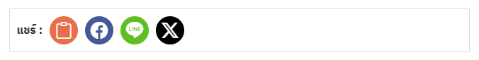

# ICON Share Buttons

ปลั๊กอิน WordPress สำหรับเพิ่มปุ่มแชร์โพสต์ในเว็บไซต์ ช่วยให้ผู้ใช้สามารถแชร์เนื้อหาไปยังแพลตฟอร์มยอดนิยม เช่น Facebook, LINE และ Twitter (X) ได้ง่ายและสะดวก

## คุณสมบัติเด่น

- **ปุ่มแชร์แบบกำหนดเอง**: รองรับการแชร์โพสต์ไปยัง Facebook, LINE และ Twitter (X)
- **คัดลอกลิงก์**: ให้ผู้ใช้คัดลอกลิงก์ของโพสต์ได้ง่าย ๆ
- **ดีไซน์ตอบสนอง (Responsive Design)**: ปุ่มถูกออกแบบให้แสดงผลได้ดีทั้งในเดสก์ท็อปและมือถือ
- **รองรับ Bootstrap Icons**: ใช้ไอคอนที่ทันสมัยและสวยงามจาก Bootstrap 5

## วิธีการติดตั้ง

1. **ดาวน์โหลดปลั๊กอิน**:
   - ดาวน์โหลดไฟล์ `.zip` จาก GitHub หรือคลังปลั๊กอิน
2. **อัปโหลดปลั๊กอิน**:
   - ไปที่หน้าผู้ดูแลระบบ WordPress
   - ไปที่ `ปลั๊กอิน > เพิ่มปลั๊กอินใหม่ > อัปโหลดปลั๊กอิน`
   - เลือกไฟล์ `.zip` ที่ดาวน์โหลดมา แล้วคลิก "ติดตั้ง"
3. **เปิดใช้งานปลั๊กอิน**:
   - ไปที่ `ปลั๊กอิน > ปลั๊กอินที่ติดตั้ง` และคลิก **เปิดใช้งาน** สำหรับปลั๊กอิน "ICON Share Buttons"

## การใช้งาน

หลังจากเปิดใช้งาน ปุ่มแชร์จะปรากฏโดยอัตโนมัติในหน้าของโพสต์ทุกหน้า ผู้ใช้สามารถ:
- แชร์โพสต์ไปยัง Facebook, LINE และ Twitter (X)
- คัดลอกลิงก์ของโพสต์ไปยังคลิปบอร์ด

## ตัวอย่างหน้าจอ (Screenshots)

**ตัวอย่างปุ่มแชร์**  
   

## การเปลี่ยนแปลง (Changelog)

### เวอร์ชัน 1.0
- เปิดตัวเวอร์ชันแรก
- เพิ่มปุ่มแชร์สำหรับ Facebook, LINE และ Twitter (X)
- เพิ่มฟังก์ชันคัดลอกลิงก์

## ผู้พัฒนา

**Nakharin**  
เว็บไซต์: [www.nakharin.in.th](https://www.nakharin.in.th)

## ใบอนุญาต (License)

ปลั๊กอินนี้ได้รับอนุญาตภายใต้ [MIT License](LICENSE)
